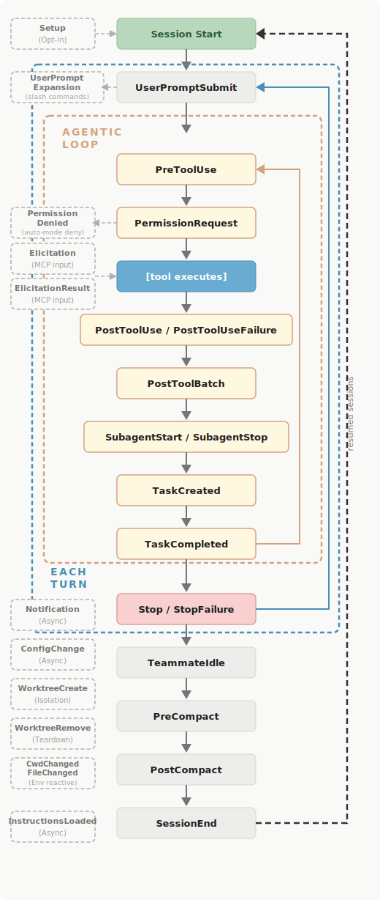

# Hooks

Hooks are user-defined shell commands, HTTP endpoints, or LLM prompts that execute automatically at specific points in Claude Code's lifecycle.

What makes hooks unique is that they are **deterministic** - they always execute at the same points in the lifecycle.

If you specify an action that must be taken every time in the CLAUDE.md file, most of the time it will be executed, but not always. Hooks are guaranteed to execute.

## Common use cases

- Auto-formatting after file edits
- Logging all executed commands for compliance
- Blocking dangerous operations like modifying production files
- Sending yourself notifications when Claude finishes a task

## Hook lifecycle

Hooks fire at specific points in the Claude Code lifecycle. When an event fires and a matcher matches, Claude Code passes JSON context about the event to your hook handler

Events fall into three cadences:

- Once per session (`SessionStart`, `SessionEnd`)
- Once per turn (`UserPromptSubmit`, `Stop`, `StopFailure`)
- On every tool call inside the agentic loop (`PreToolUse`, `PostToolUse`)

[Here](https://code.claude.com/docs/en/hooks#hook-events) you can find the full list of events and matchers.



## How they work

Hooks are configured in the `.claude/settings.json` file.

```json
{
  "hooks": {
    "PreToolUse": [
      {
        "matcher": "Bash",
        "hooks": [
          {
            "type": "command",
            "if": "Bash(rm *)",
            "command": "${CLAUDE_PROJECT_DIR}/.claude/hooks/block-rm.sh",
            "args": []
          }
        ]
      }
    ]
  }
}
```

**Command hooks** run as a subprocess in the project working directory.

- **Input**: JSON context payload delivered via **stdin**, always including `session_id` plus event-specific fields — e.g. `PreToolUse` adds `tool_name` and `tool_input`; `UserPromptSubmit` adds the raw `prompt`; `PostToolUse` adds `tool_response`.
- **Output**: Communicates back via **exit code** and optional **stdout JSON**. Exit `0` = proceed normally; exit `2` = block the action and surface stderr to Claude as an error; any other non-zero = non-blocking error, logged but execution continues.
- **Blocking**: `PreToolUse` and `UserPromptSubmit` can block execution. `PostToolUse` can suppress a tool result from Claude's context via `suppressOutput: true` in stdout JSON. Session and Stop events are observational only.

**HTTP hooks** send a POST request to a configured URL.

- **Input**: Same JSON context payload as command hooks, sent as the **request body**. Headers and auth tokens can be configured alongside the endpoint URL.
- **Output**: Claude Code reads the JSON **response body**. The response may include a `decision` field (`"approve"` or `"block"`) and a `reason` string surfaced to Claude.
- **Blocking**: Same events can block as with command hooks — `PreToolUse` and `UserPromptSubmit` — based on the `decision` field in the response. Best suited for remote logging, audit trails, or centralized policy enforcement.
